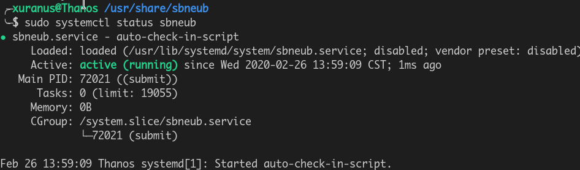
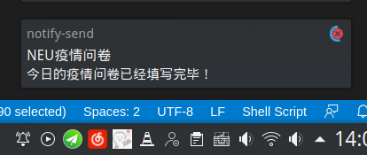

# NEU自动疫情打卡
> 实在不知道这个东西有什么用，顺便说一句这个系统还是明文存的密码，不排除泄露的可能

 - Linux Only

### 安装/卸载
```
sudo ./install
sudo ./uninstall
```

### 使用
在`/usr/share/config.rc`中配置信息，然后启动守护进程：
```
sudo systemctl enable sbneub
sudo systemctl start sbneub
```



初学bash,写的很屎，守护进程应该还有问题，手动提交直接 `bash submit`

### 效果
后台运行，弹窗提醒

